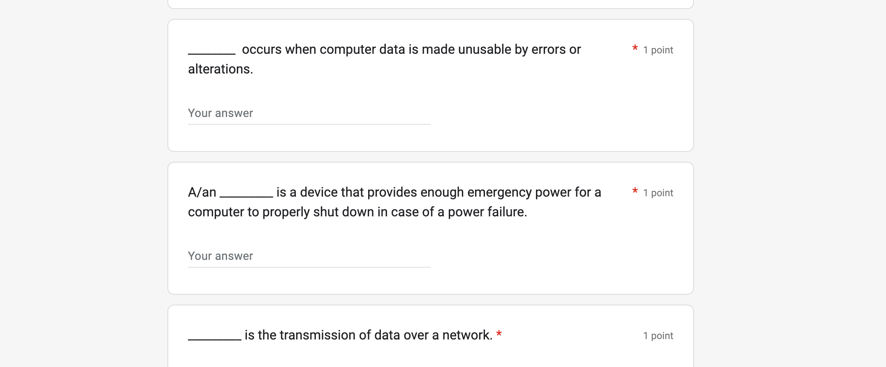

# Google form to Quizlet quiz

In preperation for O-Levels, my Computing class received Google forms to recap Computing terminology (one form for each chapter of the O-Level Computing textbook).



A friend suggested that it might be helpful if the questions and answers from the form were converted to [Quizlet](https://quizlet.com) flashcards, so that's what this short Python script does.


After you complete a Google form, you receive an email containing your responses. This script takes in those email files (`.eml`) and outputs a text file whose contents can be copied into Quizlet to create a flashcard set. The assumption being made is that all the responses in the email are correct.

## Usage

Install the dependencies before running the script.

```
pip install -r requirements.txt
```

Once the dependencies are installed,

1. Download the email(s) containing your Google form responses, then place them in the "input" folder.
2. Run the script with `python3 main.py`.
3. Copy the contents of the generated text files into the "import" box on Quizlet's study set creation page.